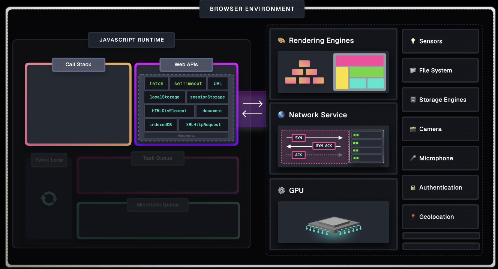
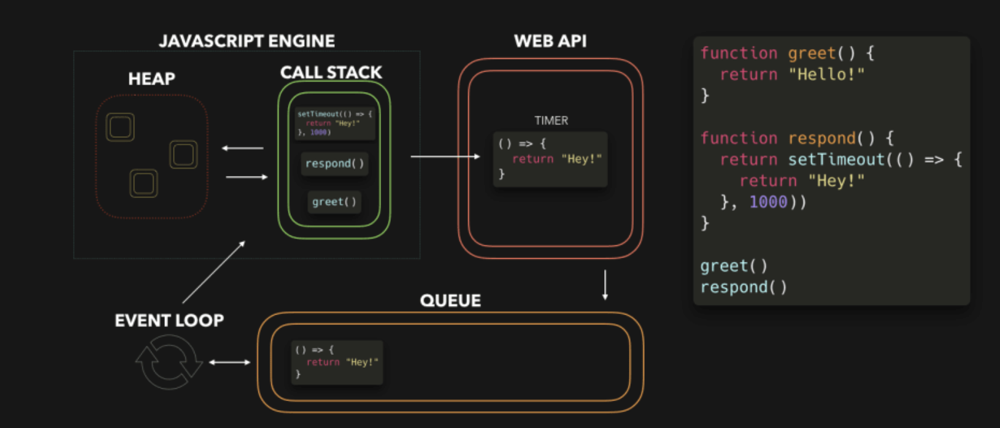
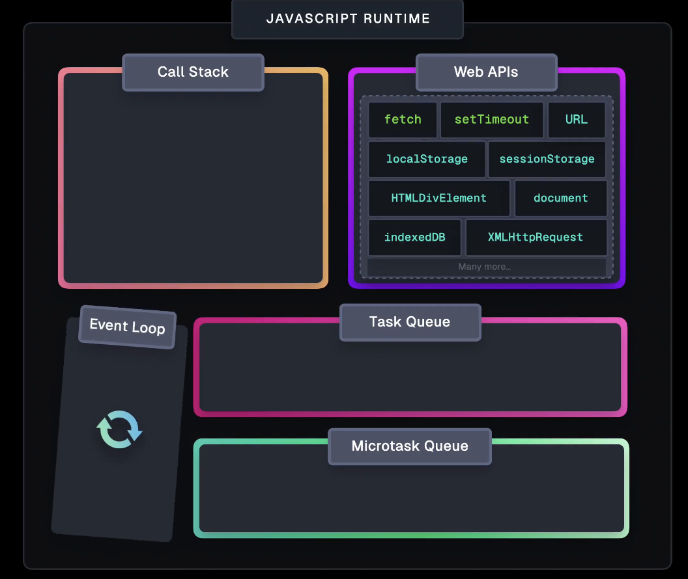

# JavaScript Visualized: Event Loop, Web APIs, (Micro)task Queue

## Understanding JavaScript Execution Context and Web APIs

### Call Stack

JavaScript is single-threaded, meaning it can only handle one task at a time. To manage this, JavaScript uses a **Call Stack** that keeps track of function execution.

- When a function is called, an **Execution Context** is _created_ and pushed onto the Call Stack. This context contains information about the function, such as its variables, scope, and the value of this.

Once the function finishes executing, its **Execution Context** is popped off the Call Stack, allowing the next function to be processed.

- If a function takes too long to complete, it can block the **Call Stack**, preventing other tasks from being executed. This could make the application _unresponsive_.

- However, in modern applications, we often need to perform **longer-running tasks**, like making _network requests_ or handling _user input_.

- If JavaScript could only handle one task at a time, our applications would freeze during these operations. Fortunately, that's not the case.

### Web APIs

The browser environment provides Web APIs, which extend JavaScript's capabilities by interacting with browser features.

- Examples of Web APIs include the **DOM** (Document Object Model), fetch for network requests, and setTimeout for timers.

- Web APIs allow JavaScript to offload certain tasks to the browser, enabling asynchronous operations.
- This means that while a task is being processed by the browser, JavaScript can continue executing other code without being blocked.

### Asynchronous Tasks and Web APIs

When you initiate an asynchronous task, such as making a **network** request using **fetch**, the following happens:

- The function call (e.g., fetch(...)) is pushed onto the Call Stack.
- The function is executed, and its task (like making a network request) is offloaded to the browser.
- The function is then popped off the Call Stack, allowing other code to run.

Since the network request is handled by the browser, the JavaScript engine doesn't have to wait for the result. Instead, it continues executing the next lines of code, keeping the application responsive.

### Handling Callbacks with Web APIs

Some Web APIs use a callback-based approach. For example, the Geolocation API provides the getCurrentPosition method, which takes two **callbacks**: one for _success_ and one for _errors_.

- When getCurrentPosition is called, a new Execution Context is created and pushed onto the Call Stack.
- The function registers its callbacks and offloads the operation to the browser.
- The Execution Context is then popped off the Call Stack.
- If the user allows access to their location, the browser retrieves the data and triggers the success callback. However, this callback cannot simply be pushed onto the Call Stack immediately, as it could disrupt an ongoing task.

### Task Queue and Event Loop

To handle response from callbacks, JavaScript uses the **Task Queue** (also known as the **Callback Queue**).

- The Task Queue holds callbacks and event handlers that are waiting to be executed.
- The Event Loop continuously checks if the **Call Stack** is empty.
- If it is, the **Event Loop** takes the first task from the **Task Queue** and _pushes_ it onto the **Call Stack**.

- This process ensures that **asynchronous callbacks** are executed as soon as possible without interrupting ongoing tasks.
- The Event Loop is crucial for managing the order of operations and ensuring that the application remains _responsive_.

### The Microtask Queue

In addition to the **Task Queue**, JavaScript has a Microtask Queue with **higher priority**.
The Microtask Queue handles operations like:

- Promise handlers (then, catch, finally)
- Async function bodies after await
- MutationObserver callbacks
- queueMicrotask callbacks.

When the **Call Stack** is _empty_, the **Event Loop** first processes all **microtasks** from the **Microtask Queue** before moving on to the **Task Queue**. This ensures that microtasks related to just-completed tasks are handled immediately, maintaining the program's responsiveness.

Example: **setTimeout** and **fetch**.

Consider the setTimeout function:

- When you call setTimeout, the function's **Execution Context** is pushed onto the **Call Stack**.
- The browser starts the timer, and the function is popped off the Call Stack.
- Once the timer expires, the **callback** is added to the **Task Queue**.
- It’s important to note that the delay you specify is the time after which the **callback** is _pushed_ to the **Task Queue**, not the **Call Stack**.
- The actual execution may take longer if the Call Stack is busy.

Similarly, when you use fetch:

- The fetch function call is added to the Call Stack.
- A Promise is created, and the network request is initiated.
- The function is popped off the Call Stack, and the JavaScript engine continues executing the next lines.
- Once the server responds, the Promise is resolved, and its handler is added to the Microtask Queue.

#### Are All Web APIs Asynchronous?

No, not all Web APIs initiate asynchronous operations. For example, methods like document.getElementById() or localStorage.setItem() are handled synchronously.

## Summary

- **Call Stack:** Manages function execution and ensures only one task is executed at a time.
- **Web APIs:** Extend JavaScript’s capabilities by allowing interaction with the browser’s features.
- **Task Queue:** Holds Web API callbacks and event handlers, waiting to be executed by the Event Loop.
- **Microtask Queue:** Handles high-priority tasks, like promise handlers and async function results, ensuring responsiveness.
- **Event Loop:** Continuously checks the Call Stack and manages tasks from the Task Queue and Microtask Queue.

This structure allows JavaScript to remain responsive even when performing complex or time-consuming operations.
