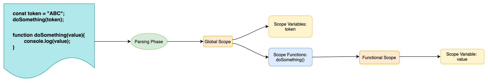

# How Does Javascript Execute Programs?

Before understanding how JavaScript executes a code/program, we will first explore the different steps that are involved in any compilation process from a compiler theory perspective.

For any language, the compiler performs the following operations:

## Tokenizing/Lexing

In this process, the entire program is divided into keywords which are called tokens. For example, consider the following statement: let temp = 10 – once the tokenization is applied it will divide this statement into keywords as follows: let, temp, =, 10.

Lexing and tokenizing terms are used interchangeably, but there is a subtle difference between them. Lexing is a process of tokenization but it also checks if it needs to be considered as a distinct token. We can consider Lexing to be a smart version of tokenization.

### Parsing

This is a process of collecting all the tokens generated in the previous step and turning them into a nested tree structure that grammatically represents the code.

This tree structure is called an abstract syntax tree (AST).

### Code Generation

This process converts the AST into machine-readable code.

So this was a brief explanation of how the compiler works and generates a machine-readable code.

Of course there are more steps apart from the ones that are mentioned above. But explaining the other steps/phases of the compiler is out of scope for this article.

The most important observation that we can make about JS execution is that to execute code, it goes through two phases:

1. Parsing
2. Execution

Before we understand lexical scope, it is important to first understand how JavaScript executes a program. In the next sections, we will dive deeper into how these two phases work.

## How JavaScript Parses/Compiles and Executes Code



_Parsing phase_

Let's first talk about the parsing phase. In this phase, the JavaScript engine goes through the entire program, assigns variables to their respective scopes, and also checks for any errors. If it finds an error then the execution of the program is stopped.

In the next phase, the actual execution of the code takes place.

To understand this in more detail we will look into the following two scenarios:

- Syntax Error
- Variable hoisting

### Syntax Error

To show you how JS first parses the program and then executes it, the best and simplest way is to demonstrate the behavior of a syntax error.

Consider the following buggy code:

```JS
const token = "ABC";
console.log(token);

//Syntax error:
const newToken = %((token);
```

The above program will generate a syntax error at the last line. This is what the error will look like:

```JS
Uncaught SyntaxError: Unexpected token '%'
```

If you look at the error, the JavaScript engines did not execute the console.log statement. Instead, it went through the entire program in the following manner:

- Line 1, found that there was a variable declaration and definition. So it stored the reference of the token variable in the current scope, that is global scope.

- Line 2, JavaScript engine discovered that the token variable is being referenced. It first referred to the current scope to check if the token variable was present or not. If it’s present then it's referred to token variable’s declaration.
- Line 3, the engine discovered that newToken variable was being declared and defined. It checked if any variable with the name newToken was present in the current scope or not. If yes, then throws a reference error. If no, then stores the reference of this variable in the current scope.
- At the same line, the engine also discovered that it was trying to refer to a variable %((token). But it found that it started with % and variable names cannot start with reserved keywords, so it threw a syntax error.

https://www.freecodecamp.org/news/lexical-scope-in-javascript/

## Variable/Function Hoisting

Hoisting is a mechanism via which all the variables present in their respective scopes are hoisted, that is made available at the top.

> variable initialization using let or const don't get hoisted.
>
> **Temporal Dead Zone**
>
> - Variables declared with let and const are also hoisted but, unlike var, are not initialized with a default value such as _undefined_. A _ReferenceError exception_ will be thrown if a variable declared with let or const is read before it is initialized. This is because they stay in a **Temporal Dead Zone** before they are explicitly declared

## What is Lexical Scope?

The process of determining the scopes of the variables/functions during runtime is called _lexical_ scoping. The word _lexical_ comes from the _lexical/tokenization_ phase of the JS compiler steps.

During runtime, JavaScript does these two things: parsing and execution. As you learned in the last section, during the parsing phase the scopes of the variables/functions are defined. That is why it was important to first understand the parsing phase of the code execution since it lays down the foundation for understanding lexical scope.

In laymen's terms, the parsing phase of the JavaScript engine is where lexical scoping takes place.

> First of all, during the parsing phase, a scope is assigned/referenced to a variable where it is declared.

# Temporal Dead Zone

> The variables declared using let and const are not accessible before they are initialized with some value, and the phase between the starting of the execution of block in which the variable is declared using let or const **till that variable is being initialized** is called Temporal Dead Zone for the variable.

- Accessing the variable before the initialization results in a ReferenceError.

```javascript
console.log(x);

let x;
x = 5;

/*
Uncaught ReferenceError: Cannot access 'x' before initialization
*/
```

The term "temporal" is used because the **zone depends on the order of execution** (time) rather than the order in which the code is written (position).

For example, the code below works because, even though the function that uses the let variable appears before the variable is declared, the function is called outside the TDZ.

#### Code Example

```javascript
{
  // TDZ starts at beginning of scope
  const func = () => console.log(letVar); // OK

  // Within the TDZ letVar access throws `ReferenceError`

  let letVar = 3; // End of TDZ (for letVar)
  func(); // Called outside TDZ!
}

// OUTPUT : 3
```

### Temporal Dead Zone tricky example-

```javascript
function test() {
  var foo = 33;
  if (foo) {
    let foo = foo + 55; // ReferenceError
  }
}
test();
```

> The if block is evaluated because the outer var foo has a value. However due to lexical scoping this value is not available inside the block: the identifier foo inside the if block is the let foo. The expression (foo + 55) throws a ReferenceError because initialization of let foo has not completed — it is still in the **temporal dead zone**.

## Currying

Currying is a technique in functional programming where a function that takes multiple arguments is transformed into a series of functions, each taking one argument at a time. Instead of passing all arguments at once, you pass them one by one, and each intermediate function returns a new function that expects the next argument.

The main idea is that a function with multiple arguments can be broken down into a sequence of unary functions, which each take one argument and return a new function, ultimately resulting in the desired output.

Example of Currying
Let's consider a simple example of a function that takes three arguments and adds them together:

#### Without Currying (Regular Function)

```JS
function add(x, y, z) {
  return x + y + z;
}

console.log(add(1, 2, 3)); // Output: 6
```

#### With Currying

```javascript
function add(x) {
  return function (y) {
    return function (z) {
      return x + y + z;
    };
  };
}

console.log(add(1)(2)(3)); // Output: 6
```

In the curried version, the function add is broken down into a sequence of functions, each returning another function that takes the next argument until all arguments have been provided.

#### How Currying Works

- The first function takes the first argument and returns another function.
- The second function takes the second argument and returns another function.
- The third function takes the third argument and returns the result of the computation.

### Benefits of Currying

1. **Reusability:** You can create specialized versions of the function by pre-filling some of the arguments (partial application).
   Example:

```javascript
const addFive = add(5);
console.log(addFive(10)(15)); // Output: 30
```

2. **Modularity:** It breaks down a multi-argument function into smaller pieces, allowing for better composition of functions.

3. **Delaying Execution:** You can delay function execution until all arguments are available.

4. **Functional Programming:** Currying is a core concept in functional programming, where functions are treated as first-class citizens.

### Example with Practical Use Case

Suppose you have a function that multiplies two numbers, and you want to create a partially applied function for multiplication by 2:

```javascript
function multiply(x) {
  return function (y) {
    return x * y;
  };
}

const multiplyByTwo = multiply(2);

console.log(multiplyByTwo(5)); // Output: 10
```

Here, multiplyByTwo is a partially applied function that multiplies any number by 2.

### Currying vs Partial Application

- Currying transforms a function that takes multiple arguments into a chain of functions that take one argument at a time.
- Partial application is when you fix some arguments of a function and get a new function that takes fewer arguments.

### Summary

Currying is a powerful functional programming technique that transforms a function with multiple arguments into a series of nested functions that each take one argument. It allows for flexibility, reusability, and composition of functions, which is especially useful in functional programming.

LINKS :
https://dev.to/pranav016/advanced-javascript-series-part-1-behind-the-scenes-javascript-engine-ats-hidden-classes-garbage-collection-3ajj
