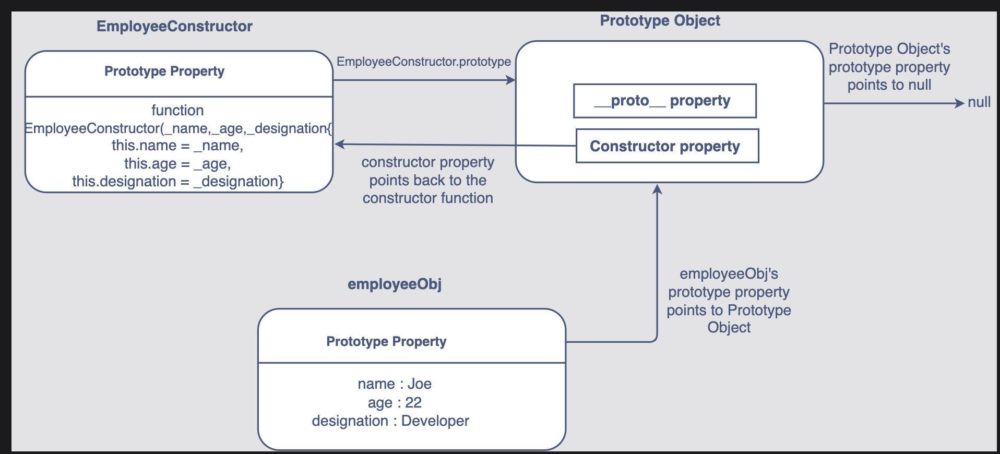
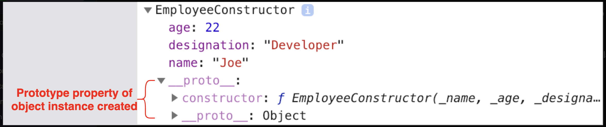

# Prototype Objects

Prototype Properties in Objects
Instead of jumping directly into the definition, let’s begin by looking at the code below:

```javascript
//creating an constructor function  named EmployeeConstructor
function EmployeeConstructor(_name, _age, _designation) {
  (this.name = _name), (this.age = _age), (this.designation = _designation);
}
//creating an object from EmployeeConstructor using "new" keyword
//The object created is stored in the variable employeeObj
var employeeObj = new EmployeeConstructor("Joe", 22, "Developer");
console.log(employeeObj);
```

As seen above, if we display **employeeObj**, the three _properties_, **name**, **age** and **designation** are displayed along with their values, encapsulated within the **EmployeeConstructor** object, which created using **new**.

If the same code is run locally on the browser, the browser console will display the following:


Notice anything different? Apart from **age**, **designation** and **name**, there is an additional property created inside the **EmployeeConstructor** object. This is known as the **[[Prototype]]** property of that object. It is a hidden property that is present inside every object created from a constructor function.

## Prototype Object

So far, we know the following:

- Any object instance created from a _constructor function_ has a hidden property.
- This hidden property is called the **[[Prototype]]** property of the object.

Just like objects, whenever a constructor function is initialized, it also gets a **[[Prototype]]** property assigned to it.

The **[[Prototype]]** property of a constructor function is an _object_ itself containing further properties; hence, it is also known as a **Prototype Object**.

At this point, you should know that the **[[Prototype]]** property of an _object instance_, **employeeObj** in our case, always points to the **Prototype Object** of the constructor function from which it was created, **EmployeeConstructor** in our case.

> Note: The prototype property in Prototype Object points to null.

### Accessing a Prototype Object

Let’s discuss how to access a Prototype Object.

In order to access the Prototype Object of the EmployeeConstructor constructor function the following syntax is used:

```javascript
//accessing the prototype property of "Employee"
EmployeeConstructor.prototype;
```

When the **EmployeeConstructor's** _[[Prototype]]_ property is accessed, the browser console displays the following:


The Prototype Object for **EmployeeConstructor** consists of two further properties:

- The **constructor** which points back to the **EmployeeConstructor** constructor function.
- The \***\* proto \*\*** property also seen as **[[Prototype]]** .

Take a look at the illustration below to visualize the concepts explained above:


### Why use Prototype Objects for Additions?

You might be wondering about the purpose of all this information and why a prototype object should be used to add properties or methods directly into the constructor.

At the start of this lesson, we created an object which was stored in employeeObj. Its properties were then displayed in the browser console. Take a look at the properties displayed again:



From the above image, you can see that the object instance’s **[[Prototype]]** property points to the Prototype object of the constructor function **EmployeeConstructor**.

This brings us to a conclusion:

> #### All objects created from a constructor function share its Prototype Object.

Due to this, if any properties/methods are added to the prototype object of the constructor function, they can be accessed by the objects created from it. This is why prototypes should be used for additions in the constructor functions.

## Using Prototype Objects

### Adding Properties

#### Syntax

Here is how properties can be added to a constructor function using the prototype property:

```JS
ConstructorFunctionName.prototype.PropertyName = PropertyValue
```

Since the property is being defined on the prototype of the _constructor function_, the double dot notation has to be used to set property values. First, the prototype property is accessed using the dot notation, then the property is defined on it using the dot operator.

Similarly, the double dot notation has to be used to get the property values defined on the prototype object as well.

```JS
//accessing the constructor property of a Prototype Object
ConstructorFunctionName.prototype.constructor

```

### Example

```JS
//constructor function called EmployeeConstructor
function EmployeeConstructor(_name, _age, _designation){
  this.name = _name
  this.age = _age
  this.designation = _designation
}

//adding a property company to the constructor
EmployeeConstructor.prototype.company = 'Google'

//creating an object called employeeObj1
var employeeObj1 = new EmployeeConstructor('Joe', 22, 'Developer')

//displaying properties of employeeObj1
console.log("Name of employee:",employeeObj1.name)
console.log("Age of employee:",employeeObj1.age)
console.log("Designation of employee:",employeeObj1.designation)
console.log("Employee works in the company:",employeeObj1.company)

//creating another object called employeeObj2
var employeeObj2 = new EmployeeConstructor('Amy', 28, 'Engineer')

//displaying properties of employeeObj2
console.log("Name of employee:",employeeObj2.name)
console.log("Age of employee:",employeeObj2.age)
console.log("Designation of employee:",employeeObj2.designation)
console.log("Employee works in the company:",employeeObj2.company)

/*
Output
Name of employee: Joe
Age of employee: 22
Designation of employee: Developer
Employee works in the company: Google
Name of employee: Amy
Age of employee: 28
Designation of employee: Engineer
Employee works in the company: Google
*/
```

The property _company_ is added to the prototype object of the **EmployeeConstructor** _constructor function_. Due to this, it automatically becomes available to both **employeeObj1** and **employeeObj2** when they are created. Hence, it can directly be accessed by both object instances.


### Adding Methods

Just like properties, methods can also be added to a constructor function’s prototype object.

#### Syntax

Here is how methods can be added to a constructor function using the prototype property:

```javascript
ConstructorFunctionName.prototype.PropertyName = PropertyValue;
```

Since the property is being defined on the prototype of the constructor function, the double dot notation has to be used to set property values. First, the prototype property is accessed using the dot notation, then the property is defined on it using the dot operator.

Similarly, the double dot notation has to be used to get the property values defined on the prototype object as well.

```JS
//accessing the constructor property of a Prototype Object
ConstructorFunctionName.prototype.constructor

```
