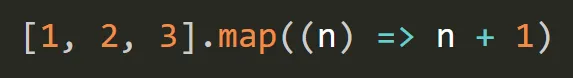
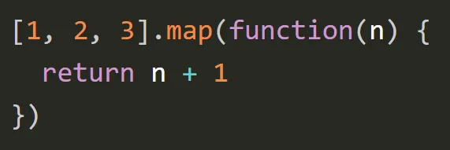

# JavaScript Polyfills

JavaScript is an ever-evolving language. New features are added to JavaScript every year. When it comes to our browsers it’s not necessary that they’ll always support the latest features. So how to make our modern code work on older engines that don’t understand recent features yet?

There are two tools for that:

1. Transpilers.
2. Polyfills.

## Transpilers

A transpiler is a special piece of software that translates source code to another source code. It can parse (“read and understand”) modern code and rewrite it using older syntax constructs so that it’ll also work in outdated engines. Babel is a transpiler and let’s see an example of how it works.

Arrow functions are not supported by IE11 and Opera Mini.


Babel is a compiler: it takes code written in one standard and transpiles it to code written into another standard. Here Babel will convert it into something like this.


## Polyfills

Polyfills are custom implementations of functions or features that replicate the behavior of modern JavaScript methods in environments (like older browsers) where those methods don't exist.

1. forEach Polyfill
   The forEach method executes a provided function once for each array element.
   - ForEach will never return a array. It returns single elements independently.

##### Native Example:

```javascript
const arr = [1, 2, 3];
arr.forEach((num) => console.log(num)); // 1, 2, 3
```

##### Polyfill:

```javascript
Array.prototype.myForEach = function (callback) {
  for (let i = 0; i < this.length; i++) {
    callback(this[i], i, this); // element, index, array
  }
};
```

Creating a polyfill for forEach() means implementing a function that mimics the behavior of the native forEach() method.

#### Steps to Create forEach Polyfill

1. We need an array: The forEach() method works on arrays, so first, we need an array-like structure.
2. Take a callback function: forEach() takes a callback function that is executed for each element in the array. The callback receives three arguments:
   - the current element
   - the current index
   - the array itself
3. Loop through the array: We need to iterate over the array and execute the callback for each element.
4. Pass each element to the callback: The callback will be invoked with the current element of the array, along with the index and the array.

```javascript
// Creating a polyfill for Array.prototype.forEach
if (!Array.prototype.myForEach) {
  Array.prototype.myForEach = function (callback, thisArg) {
    // Step 1: We need to check if the current context is an array.
    if (this == null) {
      throw new TypeError(
        "Array.prototype.myForEach called on null or undefined"
      );
    }

    // Ensure the callback is a function.
    if (typeof callback !== "function") {
      throw new TypeError(callback + " is not a function");
    }

    // Get a reference to the array.
    const array = this;

    // Step 2: Loop through the array.
    for (let i = 0; i < array.length; i++) {
      // Step 3: Call the callback with element, index, and array.
      callback.call(thisArg, array[i], i, array);
    }
  };
}

// Example usage:
const arr = [1, 2, 3, 4];

// Using our custom forEach polyfill
arr.myForEach(function (element, index, array) {
  console.log("Element:", element, "Index:", index);
});

/*
Element: 1 Index: 0
Element: 2 Index: 1
Element: 3 Index: 2
Element: 4 Index: 3
*/
```

### Explanation:

1. **Checking for null or undefined:** The first thing we do is check if the array is null or _undefined_, as the _forEach()_ method should throw an error if called on a non-existent array.

2. **Checking if the callback is a function:** Since the argument passed to _forEach_ must be a function, we validate whether the callback is a function, and throw an error if it isn’t.

3. **Accessing the array:** The _this_ keyword refers to the array on which the _myForEach()_ method is called, and we store it in the variable _array_ for easier reference.

4. **Looping through the array:** We iterate through the array using a for loop.

5. **Calling the callback:** For each element, we invoke the _callback_ function using _callback.call()_. This allows us to pass in the _thisArg_ (context), and provide the current element, its index, and the array as arguments.

### How This Polyfill Works:

- We’ve added a new method called _myForEach_ to **Array.prototype**.
- This method accepts a **callback** function and an optional **thisArg** (to specify the context in which the callback should be executed).
- The callback is then executed for each element in the array along with its index and the full array itself, mimicking the native **forEach()** behavior.

This polyfill effectively simulates the behavior of the native forEach() method in environments where it might not be available.

## Polyfill Map

Creating a polyfill for Array.prototype.map() involves implementing a function that behaves like the native map() method.

### Steps to Create map Polyfill

1. **We need an array:** The map() method works on arrays and transforms the array by applying a callback function to each element.
2. **Take a callback function:** map() takes a callback function that is executed for each element in the array. This function receives three arguments: the current element, the current index, and the array.
3. **Loop through the array:** We need to iterate over the array and execute the callback for each element.
4. **Store the results:** The result of each callback execution needs to be stored in a new array, which will be returned at the end.

#### Polyfill Code Example:

```javascript
// Creating a polyfill for Array.prototype.map
if (!Array.prototype.myMap) {
  Array.prototype.myMap = function (callback, thisArg) {
    // Step 1: Check if the current context is an array.
    if (this == null) {
      throw new TypeError("Array.prototype.myMap called on null or undefined");
    }

    // Step 2: Ensure the callback is a function.
    if (typeof callback !== "function") {
      throw new TypeError(callback + " is not a function");
    }

    // Step 3: Create a new array to hold the results.
    const result = [];

    // Step 4: Reference the array.
    const array = this;

    // Step 5: Loop through the array and apply the callback.
    for (let i = 0; i < array.length; i++) {
      // Step 6: Apply the callback and push the result to the new array.
      result.push(callback.call(thisArg, array[i], i, array));
    }

    // Step 7: Return the new array with transformed values.
    return result;
  };
}

// Example usage:
const arr = [1, 2, 3, 4];

// Using our custom map polyfill
const result = arr.myMap(function (element, index) {
  return element * 2; // Transform each element by multiplying it by 2
});

console.log(result); // Output: [2, 4, 6, 8]
```

### Explanation:

1. **Checking for null or undefined:** As with the forEach polyfill, we first check if the array is null or undefined. If it is, a TypeError is thrown.

2. **Checking if the callback is a function:** Since map() requires a valid function as an argument, we check if the provided callback is indeed a function, throwing an error if it is not.

3. **Creating a new array:** We initialize an empty array result that will hold the transformed values returned by the callback function.

4. **Iterating over the array:** We loop through the array using a for loop, and for each element, we invoke the callback function with callback.call(). The thisArg (optional context) is passed to ensure proper handling of the this context inside the callback, and the current element, index, and array are passed as arguments.

5. **Storing the result:** For each element, the result of the callback function is stored in the new result array.

6. **Returning the new array:** Finally, we return the result array which contains all the transformed elements.

### How This Polyfill Works:

- We’ve added a new method called myMap to Array.prototype.
- This method accepts a callback function and an optional thisArg (context).
- The callback is applied to each element in the array, and the results are stored in a new array, which is returned at the end, replicating the behavior of the native map() method.

This polyfill mimics the behavior of the native map() method by iterating through each element in the array and applying the transformation logic defined in the callback function.

## Polyfill filter

To create a polyfill for the filter() method, we need to replicate the behavior where the method creates a new array with all elements that pass the test implemented by a provided callback function.

#### Steps to Create filter Polyfill:

1. We need an array: filter() is called on an array and returns a new array.
2. Take a callback function: The filter() method takes a callback function that is executed for each element of the array. This function receives the element, its index, and the array itself as arguments.
3. Loop through the array: For each element, we call the callback and check if it returns true. If it does, we include that element in the new array.
4. Return a new array: After the loop, return the new array containing only the elements that passed the test.

#### Polyfill Code Example:

```javascript
// Creating a polyfill for Array.prototype.filter
if (!Array.prototype.myFilter) {
  Array.prototype.myFilter = function (callback, thisArg) {
    // Step 1: Check if the current context is an array.
    if (this == null) {
      throw new TypeError(
        "Array.prototype.myFilter called on null or undefined"
      );
    }

    // Step 2: Ensure the callback is a function.
    if (typeof callback !== "function") {
      throw new TypeError(callback + " is not a function");
    }

    // Step 3: Create an array to store the filtered elements.
    const result = [];
    const array = this; // Reference to the array

    // Step 4: Loop through the array.
    for (let i = 0; i < array.length; i++) {
      // Step 5: Call the callback with the element, index, and array.
      if (callback.call(thisArg, array[i], i, array)) {
        // Step 6: If the callback returns true, push the element into the result array.
        result.push(array[i]);
      }
    }

    // Step 7: Return the new filtered array.
    return result;
  };
}

// Example usage:
const numbers = [1, 2, 3, 4, 5, 6];

// Using our custom filter polyfill
const evenNumbers = numbers.myFilter(function (num) {
  return num % 2 === 0; // Keep only even numbers
});

console.log(evenNumbers); // Output: [2, 4, 6]
```

##### Explanation:

1. Checking for null or undefined: The polyfill checks if the array is null or undefined. If so, it throws a TypeError similar to the native filter() method.

2. Ensuring the callback is a function: The callback provided must be a function. If it's not, the polyfill throws a TypeError.

3. Creating a new array for results: An empty array result is created to store the elements that pass the test (i.e., when the callback returns true).

4. Looping through the array: We loop through each element of the array, passing it, along with its index and the array itself, to the callback function.

5. Checking the callback result: If the callback function returns true for an element, we push that element into the result array.

6. Returning the filtered array: After the loop is completed, the result array, which contains all the elements that passed the test, is returned.

### Example of Filtering an Array:

```javascript
const words = ["apple", "banana", "cherry", "date"];

// Filtering words that contain the letter 'a'
const wordsWithA = words.myFilter(function (word) {
  return word.includes("a");
});

console.log(wordsWithA); // Output: ['apple', 'banana', 'date']
```

### Important Points:

- The filter() method does not modify the original array. Instead, it creates a new array with the elements that pass the condition.
- The callback function is called for each element in the array, and only elements for which the callback returns true are included in the new array.
- Optional thisArg: You can provide an optional thisArg to set the this context inside the callback. This is supported in the polyfill with callback.call(thisArg, ...).

This polyfill mimics the native behavior of the filter() method, including the handling of the thisArg and proper iteration over array elements.

## Polyfill reduce()

To create a polyfill for the reduce() method, we need to implement the logic that aggregates values in an array into a single output based on a callback function. Here's a step-by-step approach and the code for the polyfill.

### Steps to Create reduce Polyfill:

1. We need an array: The reduce() method works on arrays and reduces the array to a single value by applying a callback function.
2. Take a callback function: reduce() takes a callback function that is executed for each element in the array.This function receives four arguments:

   - the accumulator,
   - the current element,
   - the current index
   - the array.

3. Initial value: reduce() optionally takes an initial value. If no initial value is provided, the first element of the array is used as the initial accumulator value.
4. Loop through the array: We need to iterate through the array and update the accumulator by applying the callback function for each element.
5. Return the accumulator: After all elements have been processed, the final value of the accumulator is returned.

#### Polyfill Code Example:

```javascript
// Creating a polyfill for Array.prototype.reduce
if (!Array.prototype.myReduce) {
  Array.prototype.myReduce = function (callback, initialValue) {
    // Step 1: Check if the current context is an array.
    if (this == null) {
      throw new TypeError(
        "Array.prototype.myReduce called on null or undefined"
      );
    }

    // Step 2: Ensure the callback is a function.
    if (typeof callback !== "function") {
      throw new TypeError(callback + " is not a function");
    }

    // Step 3: Reference the array.
    const array = this;
    let accumulator;
    let startIndex;

    // Step 4: Check if an initial value is provided.
    if (arguments.length > 1) {
      // If an initial value is provided, set it as the accumulator.
      accumulator = initialValue;
      startIndex = 0; // Start from the first element
    } else {
      // If no initial value is provided, use the first array element as the accumulator.
      if (array.length === 0) {
        throw new TypeError("Reduce of empty array with no initial value");
      }
      accumulator = array[0]; // Use the first element
      startIndex = 1; // Start from the second element
    }

    // Step 5: Loop through the array and apply the callback.
    for (let i = startIndex; i < array.length; i++) {
      accumulator = callback(accumulator, array[i], i, array);
    }

    // Step 6: Return the accumulated value.
    return accumulator;
  };
}

// Example usage:
const numbers = [1, 2, 3, 4];

// Using our custom reduce polyfill
const sum = numbers.myReduce(function (acc, current) {
  return acc + current; // Sum all numbers
}, 0);

console.log(sum); // Output: 10
```

### Explanation:

1. Checking for null or undefined: The polyfill first checks if the array is null or undefined. If so, it throws a TypeError, just like the native reduce() method.

2. Checking if the callback is a function: Since reduce() requires a valid function as the callback, we check if the provided callback is a function, throwing an error if it is not.

3. Setting the accumulator: If an initialValue is provided, it's set as the accumulator. If no initial value is provided, we set the first element of the array as the accumulator.

4. Iterating over the array: We start the iteration either from the first element (if an initial value is provided) or from the second element (if no initial value is provided). The callback function is invoked for each element, updating the accumulator with the returned value.

5. Returning the result: After all elements have been processed, the final accumulated value is returned.

#### How This Polyfill Works:

- We’ve added a new method called myReduce to Array.prototype.
- This method accepts a callback function and an optional initialValue.
- The callback is applied to each element in the array, updating the accumulator with the result.
- The method returns the final accumulated value, which mirrors the behavior of the native reduce() method.

##### Example of Reducing an Array:

```javascript
const numbers = [1, 2, 3, 4];

const product = numbers.myReduce(function (acc, current) {
  return acc * current; // Multiply all numbers
}, 1);

console.log(product); // Output: 24
```

In this example, the myReduce method multiplies all the numbers in the array. The accumulator starts at 1 (since we passed an initial value of 1), and the result is 24.

### Important Points:

- If no initialValue is provided, the first element of the array is used as the accumulator.
- If the array is empty and no initialValue is provided, a TypeError is thrown.

This polyfill behaves similarly to the native reduce() method, ensuring that it follows the same rules for accumulator handling and array iteration.
